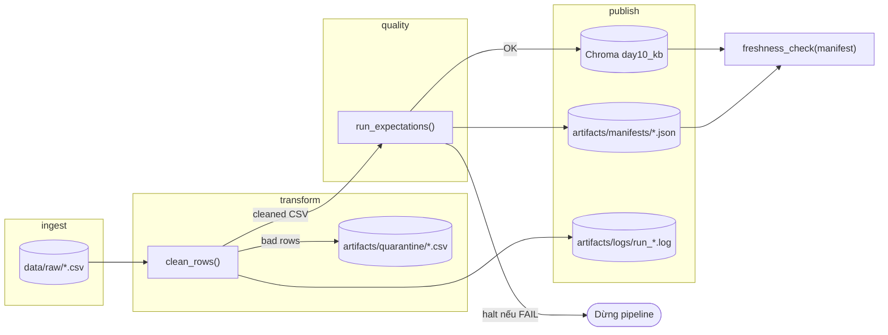

# Kiến trúc pipeline — Lab Day 10

**Nhóm:** Lab Day 10 (solo / demo)  
**Cập nhật:** 2026-04-15

---

## 1. Sơ đồ luồng (Mermaid)

**Điểm đo freshness:** sau khi ghi manifest (`latest_exported_at` từ cleaned).  
**run_id:** log + manifest + metadata embed (`run_id` trong Chroma metadata).  
**Quarantine:** file CSV song song với cleaned.

---

## 2. Ranh giới trách nhiệm

| Thành phần | Input | Output | Owner nhóm |
|------------|-------|--------|--------------|
| Ingest | Raw export path | `raw_records`, log | Ingestion owner |
| Transform | Raw rows dict | `cleaned/*.csv`, `quarantine/*.csv` | Cleaning owner |
| Quality | Cleaned rows | expectation lines trong log; exit 2 nếu halt | Quality owner |
| Embed | Cleaned CSV | Chroma upsert + prune | Embed owner |
| Monitor | Manifest JSON | `freshness_check` PASS/WARN/FAIL | Monitoring owner |

---

## 3. Idempotency & rerun

Embed dùng **`chunk_id` làm khóa Chroma**: `upsert(ids=chunk_id, …)`. Trước upsert, pipeline **xoá id có trong collection nhưng không còn trong cleaned** (`embed_prune_removed` trong log) để top-k không giữ vector “đã publish nhưng đã bỏ khỏi snapshot”. Rerun nhiều lần với cùng corpus không phình số vector vô hạn — chỉ bằng số chunk hiện hành.

---

## 4. Liên hệ Day 09

Cùng **corpus văn bản** trong `data/docs/` và narrative CS + IT Helpdesk. Day 09 multi-agent đọc retrieval; Day 10 đảm bảo **dữ liệu đưa vào index đúng version** (refund 7 ngày, HR 12 ngày) và có **manifest + eval** làm ranh giới publish trước khi agent tin vào top-k.

---

## 5. Rủi ro đã biết

- **Freshness theo `exported_at`:** snapshot cũ có thể FAIL SLA 24h — cần phân biệt SLA cho “độ tươi export” vs “độ tươi pipeline run” (ghi trong runbook).
- **Inject `--skip-validate`:** embed dữ liệu xấu phục vụ demo; không dùng cho production path.
